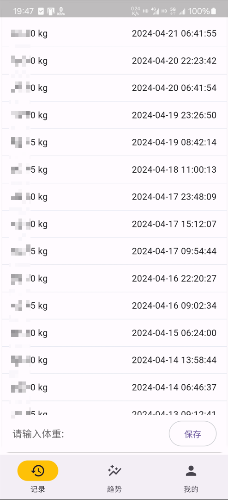
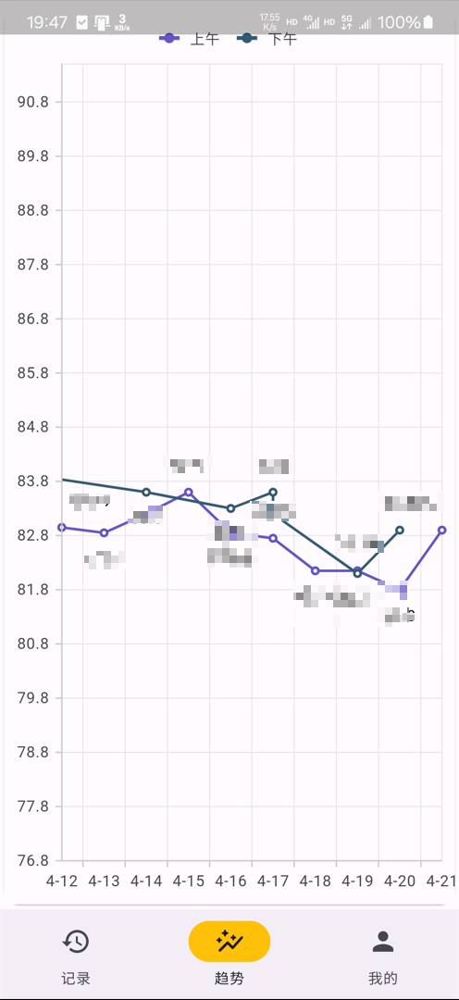

记录体重的app
数据可导出为csv文件. 导出时尽量选择公共文件夹: Document、Download、Music、Movies等公共文件夹.

若导出失败, 则在上述文件夹中新建文件夹，重新导出到新建的文件夹中.

|           记录           |           趋势           |           我的           |
|:----------------------:|:----------------------:|:----------------------:|
|  |  |  |